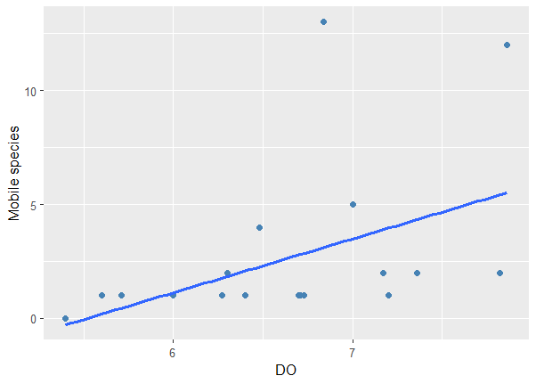
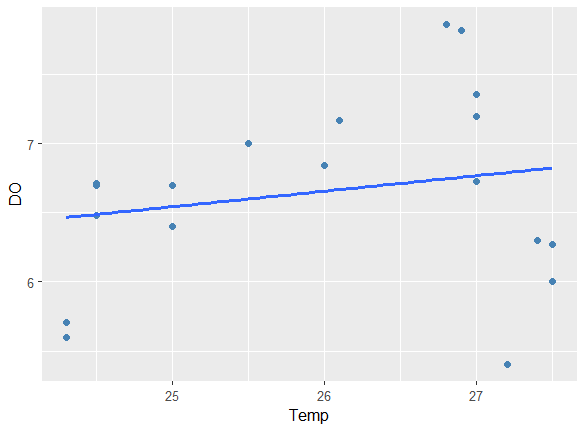
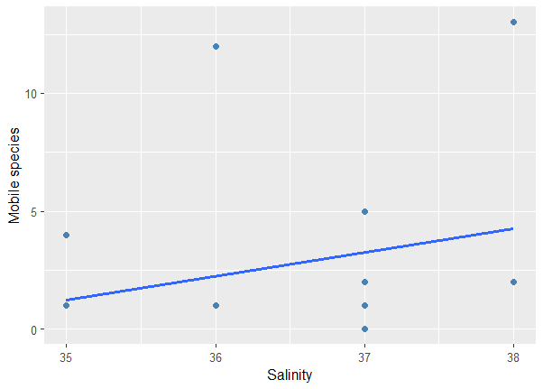
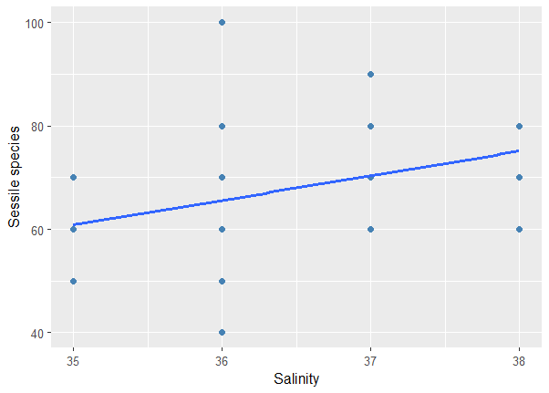
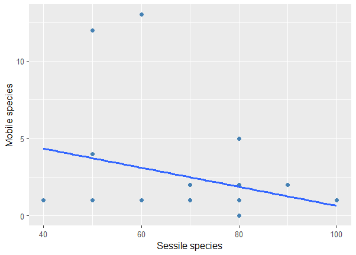
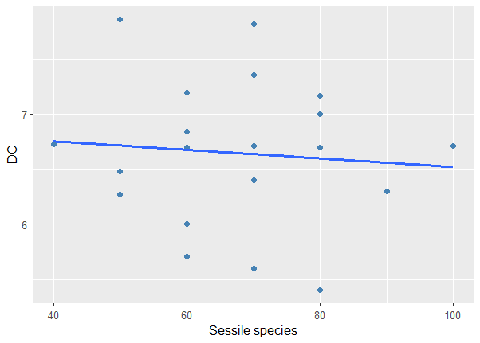
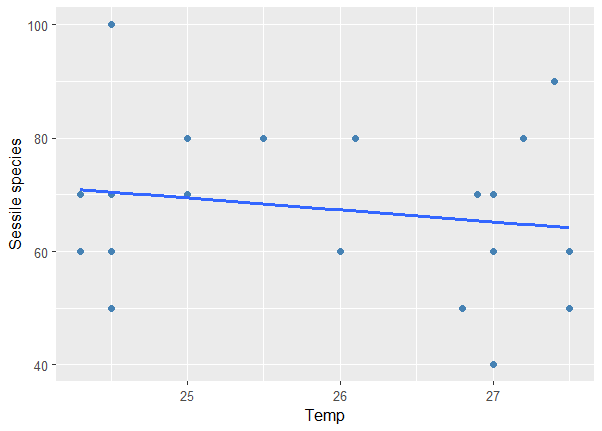

# Marine Species Environmental Analysis

## Project Title

Influence of Environmental Variables on Sessile and Motile Species Distribution in a Coastal Habitat

## Overview

This project investigates how environmental variables influence the distribution of sessile and motile marine species in a mixed intertidal coastal habitat. The study focuses on understanding how key environmental factors shape ecological patterns within coastal ecosystems.

Environmental variables analyzed include:

* Temperature
* Salinity
* Dissolved Oxygen
* Habitat Characteristics
* Species Percent Cover

The project integrates statistical analysis, data visualization, and spatial mapping to generate ecological insights.

## Objectives

* Analyze relationships between environmental variables and marine species distribution
* Identify ecological patterns affecting sessile and motile organisms
* Visualize environmental influences using statistical plots
* Develop GIS-based spatial representations of habitat characteristics

## Tools and Technologies

* **R Programming** (ggplot2, dplyr)
* **ArcGIS**
* **Statistical Analysis**
* **Spatial Data Analysis**
* **R Markdown**

## Project Structure

- data/ → Environmental dataset
- scripts/ → R Markdown analysis
- figures/ → Generated graphs
- maps/ → GIS studyl area
- report/ → Final project report

## Figures

Below are selected figures generated during the analysis:

## Key Outputs

* Statistical relationships between environmental variables and species distribution
* Visualization of ecological patterns
* Spatial habitat mapping
* Scientific report documenting results

## Author

Marine Data Analyst
R Programming | GIS (ArcGIS) | Marine Science | Environmental Data Analysis
